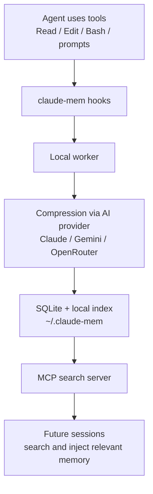
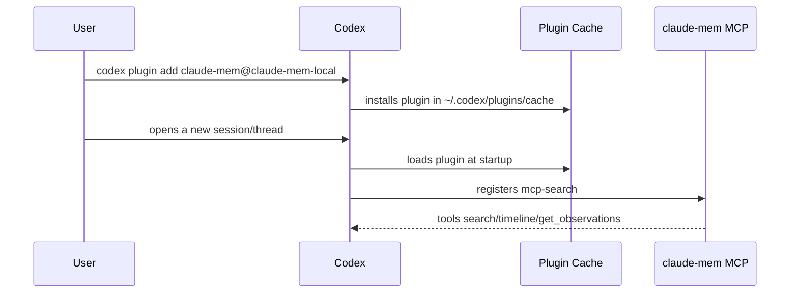
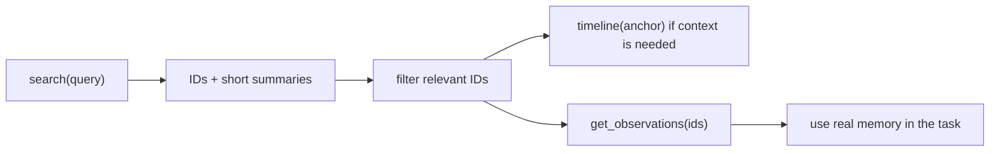
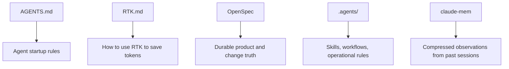
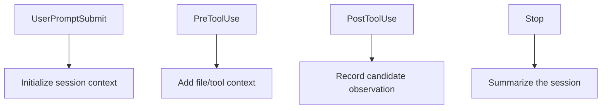

# claude-mem: Persistent Agent Memory Without Black Magic

## 1. The Context and the Problem

We were integrating agent tooling into the Entity Builders workspace:

- **RTK** to reduce noisy terminal output and token waste.
- **OpenSpec** as durable product and change memory.
- **claude-mem** as persistent cross-session agent memory.
- Eventually **Caveman**, if it adds a useful operational layer.

RTK was straightforward. It was installed, documented in `RTK.md`, and loaded
from `AGENTS.md` using `@RTK.md`. The conceptual confusion came from
`claude-mem`.

The real question was:

> If claude-mem is installed, why does Codex not seem to use it? How do I know
> whether it is actually working?

The confusion made sense because the machine showed contradictory signals.

On one side, the process was alive:

```bash
ps aux | rg -i "claude-mem|mcp-server.cjs"
```

It showed a process like:

```txt
node ~/.claude/plugins/cache/thedotmack/claude-mem/13.4.0/scripts/mcp-server.cjs
```

And the logs said:

```txt
Claude-mem search server started
Worker available {}
```

But inside Codex, no new tool appeared. `tool_search` found nothing. The
current conversation had no visible `claude-mem` skills or tools.

The system was half alive, half invisible.

## 2. The Autopsy: the Technical Journey

### The right mental model

`claude-mem` is not "a markdown file the agent reads". It is also not merely a
global command named `claude-mem`.

It is an integration made of several moving pieces:



The important bit: **the memory lives locally** in:

```txt
~/.claude-mem/
  claude-mem.db
  logs/
  settings.json
  supervisor.json
```

The agent does not remember because of personality. It remembers because there
are:

1. hooks that capture activity,
2. a worker that summarizes and compresses,
3. a local database that stores observations,
4. an MCP server that exposes search,
5. a Codex/Claude integration that gives the agent access to that search.

### The layers can be in different states

The subtle point is that `claude-mem` can be partially configured.

| Layer | Meaning | How to verify |
|---|---|---|
| Worker alive | A local process can process memory | `ps aux`, logs in `~/.claude-mem/logs` |
| Marketplace configured | Codex knows where to find the plugin | `codex plugin marketplace list` |
| Plugin installed in Codex | Codex copied the plugin into its cache and can load MCP/hooks/skills | `codex plugin list` |
| MCP exposed | Codex sees the `mcp-search` server | `codex mcp list` |
| Tools available in this session | The current conversation received those tools at startup | they appear in the thread's tool set |

In our case, the worker was alive, but Codex had not actually installed the
plugin into its plugin cache.

### The false positive

`~/.codex/config.toml` already had something like:

```toml
[marketplaces.claude-mem-local]
source_type = "local"
source = "/Users/juano/.claude/plugins/marketplaces/thedotmack"

[plugins."claude-mem@claude-mem-local"]
enabled = true
```

That looked sufficient.

It was not.

When we ran:

```bash
codex plugin list
```

the key line said:

```txt
claude-mem@claude-mem-local  not installed
```

The plugin was **enabled in config**, but **not installed**.

That is like having an app enabled in preferences without having copied the app
into the directory the runtime actually loads.

### The fix

The fix was explicit:

```bash
codex plugin add claude-mem@claude-mem-local
```

Codex responded:

```txt
Added plugin `claude-mem` from marketplace `claude-mem-local`.
Installed plugin root: ~/.codex/plugins/cache/claude-mem-local/claude-mem/13.4.0
```

Then `codex plugin list` showed:

```txt
claude-mem@claude-mem-local  installed, enabled  13.4.0
```

And `codex mcp list` showed:

```txt
mcp-search  enabled
```

That `mcp-search` server comes from `claude-mem`.

### Why the current conversation may still not see it

One subtle operational detail: a Codex conversation receives its tool set when
the thread starts. If you install a plugin while a conversation is already open,
that conversation may not see the new tools.

The correct sequence is:



If the thread was opened before the plugin was installed, it does not become
retroactively tool-aware.

### The tools behind the curtain

The `claude-mem` MCP server exposes tools such as:

| Tool | Purpose |
|---|---|
| `search` | Search observations by query, project, date, or type |
| `timeline` | Inspect context before and after an observation |
| `get_observations` | Fetch full details for specific IDs |
| `smart_search` | Explore code structurally with AST parsing |
| `smart_outline` | Get a structural outline of a file |
| `smart_unfold` | Expand one specific symbol |
| `build_corpus` | Build a knowledge corpus |
| `query_corpus` | Ask questions against a primed corpus |

The philosophy is **index first, fetch later**:



This prevents the agent from spending thousands of tokens pulling full memories
before it knows whether they matter.

## 3. Deep Dive and Extra Study

### Agent memory is not the same as documentation

Entity Builders now has several memory layers:



Each layer has a different job.

| Layer | Memory type | Example |
|---|---|---|
| `AGENTS.md` | Mandatory instructions | "Before substantial changes, read OpenSpec" |
| `RTK.md` | Tool rule | "Prefer `rtk` for noisy commands" |
| OpenSpec | Product memory | "Zigzag generates tours through Supabase Edge Functions" |
| `.agents/` | Operational memory | "How to deploy, test, design, investigate" |
| `claude-mem` | Compressed episodic memory | "On 2026-05-31 we discovered the installed Zigzag build was on channel development" |

The common mistake is expecting one layer to do all jobs.

`claude-mem` does not replace OpenSpec. If a decision is contractual or part of
the product model, it should end up in OpenSpec or permanent docs. `claude-mem`
helps preserve context and discovery history between sessions, but it is not
the source of truth.

### Hooks: the invisible mechanism

The practical power of `claude-mem` lives in its hooks.

The plugin has hooks for events like:

- `SessionStart`
- `UserPromptSubmit`
- `PreToolUse`
- `PostToolUse`
- `Stop`

Those hooks capture signals like:



In other words, the agent does not need to manually remember to write a note.
Activity is captured, compressed, and stored.

### MCP: the bridge between memory and agent

MCP, the Model Context Protocol, is a standard contract for exposing external
capabilities to an agent.

Here:

```txt
claude-mem MCP server -> search tools -> Codex/Claude
```

When `codex mcp list` shows `mcp-search`, Codex knows about the MCP server. But
for a conversation to use it, that conversation must start after the plugin is
installed and loaded.

### Quick diagnostic checklist

```bash
# 1. Is the worker/server alive?
ps aux | rg -i "claude-mem|mcp-server.cjs"

# 2. Are logs healthy?
tail -n 80 ~/.claude-mem/logs/claude-mem-$(date +%F).log

# 3. Does Codex know the marketplace?
codex plugin marketplace list

# 4. Is the plugin installed and enabled?
codex plugin list | rg claude-mem

# 5. Is the MCP visible?
codex mcp list | rg mcp-search
```

Healthy state:

```txt
claude-mem@claude-mem-local  installed, enabled
mcp-search                   enabled
```

### The architecture lesson

This was an integration bug, not a memory bug.

The failure was confusing these states:

- "config exists",
- "process exists",
- "marketplace exists",
- "installed in Codex",
- "available in this session".

They are not the same state.

Useful rule:

> In agent systems, "configured" does not mean "loaded", and "loaded" does not
> mean "available in this session".

## 4. Reflection Questions and Exercises

### Questions

1. Why can `codex plugin list` say `not installed` even though
   `~/.codex/config.toml` has `[plugins."claude-mem@claude-mem-local"] enabled = true`?

2. What is the practical difference between `claude-mem` as a local observation
   database and OpenSpec as durable product memory?

3. Why can an already-open conversation fail to see new tools even after the
   plugin is installed correctly?

### Exercises

1. **Break and repair the mental model**

   Inspect state with:

   ```bash
   codex plugin list | rg claude-mem
   codex mcp list | rg mcp-search
   ```

   Explain what each combination means:

   - installed/enabled + MCP visible
   - installed/enabled + MCP not visible
   - not installed + worker alive

2. **Test real memory**

   In a fresh Codex session, ask:

   ```txt
   Search memory for what we learned about RTK, claude-mem, and Zigzag.
   ```

   If memory works, the agent should retrieve past observations without you
   re-explaining the whole story.

3. **Decide what belongs where**

   Take these three statements and decide whether they belong in `claude-mem`,
   OpenSpec, `.agents`, or `RTK.md`:

   - "Zigzag production should publish OTA to channel production."
   - "Prefer `rtk` for commands with noisy output."
   - "On 2026-05-31 we discovered the installed Zigzag build was on channel development."

The goal is not to memorize commands. The goal is to separate **episodic
memory**, **operational rules**, **tooling**, and **product contracts**.

