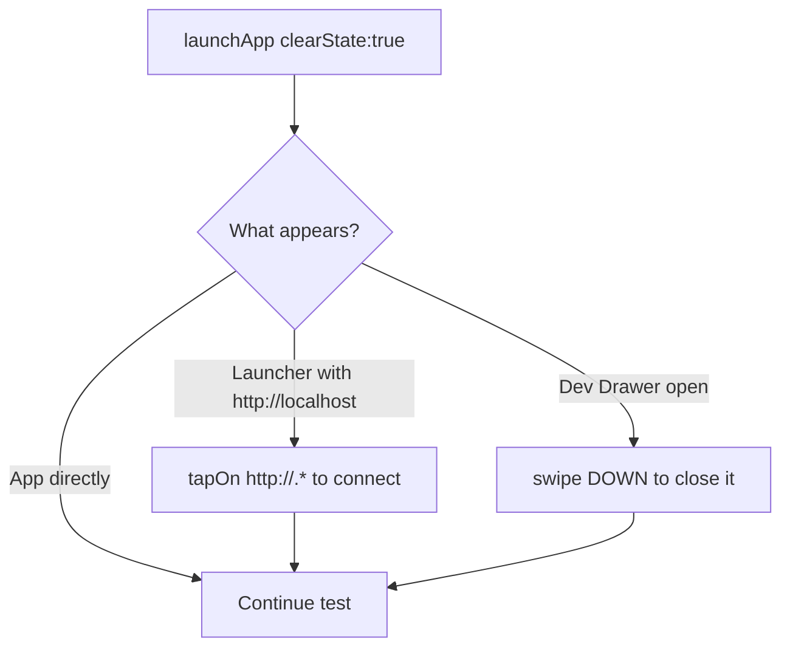
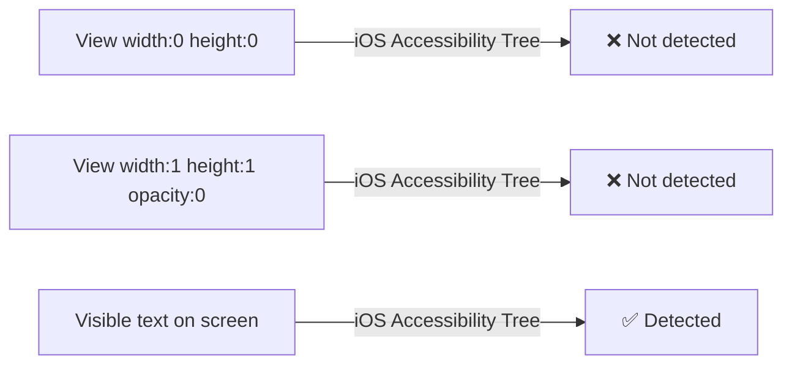
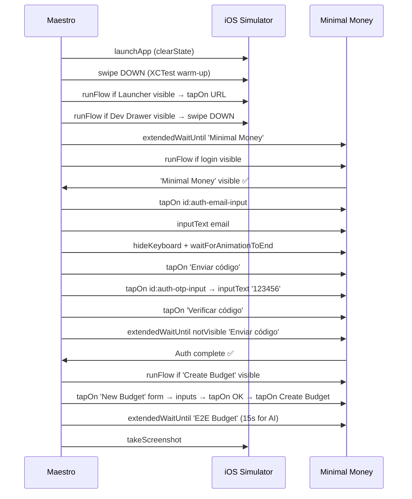

> "Mobile E2E testing isn't hard. It's *brutally* environment-specific."

We spent an entire session debugging a Maestro test for an Expo app on iOS. What should have been a straightforward "login → create budget" test turned into an autopsy of every assumption we take for granted. Here's what we learned.

---

## 1. The Context and the Problem

We had a React Native / Expo app (`minimal-money`) with two new flows:
1. An OTP authentication screen (with a backdoor for automated tests).
2. An onboarding screen to create the first budget, featuring a modern form with an iOS `InputAccessoryView` providing "OK" / "Cancel" buttons above the numeric keyboard.

The goal was to write a Maestro test covering the entire happy path: **launch → auth → create budget → main screen**.

The errors that surfaced, in chronological order:

| Error | Real Cause |
|-------|-----------|
| `"Y" appended to email` | iOS autocorrect inserting a letter before the button tap |
| `Couldn't hide the keyboard` | `hideKeyboard` on an input without stable focus |
| `Assertion is false: id: auth-loaded is visible` | 0x0 / opacity:0 View not present in iOS accessibility tree |
| `inputText` writes nothing | `tapOn` by placeholder text doesn't guarantee real focus |

---

## 2. The Autopsy (The Technical Journey)

### Problem 1: iOS Autocorrect corrupts the email

Maestro does `tapOn: 'Email'` → types `maestro@minimalmoney.com` → right before tapping the button, iOS's autocorrection engine detects `.com` as an end-of-sentence and appends a "y" or a space.

**Fix #1 — `autoCorrect={false}` on the TextInput:**
```tsx
<TextInput
  autoCapitalize="none"
  autoCorrect={false}   // ← this
  keyboardType="email-address"
/>
```

**Fix #2 — `hideKeyboard` + `waitForAnimationToEnd` before the tap:**
```yaml
- inputText: 'maestro@minimalmoney.com'
- hideKeyboard
- waitForAnimationToEnd   # waits for the keyboard dismiss animation
- tapOn: 'Enviar código'
```

> ⚠️ `wait` is **not a valid Maestro command**. The correct one is `waitForAnimationToEnd`.

---

### Problem 2: The Expo Dev Drawer opens over the app

When Maestro does `launchApp: clearState: true`, the Expo Dev Client sometimes shows the tools Drawer ("Toggle performance monitor", "Reload", etc.) **on top of the actual app screen**. Two possible scenarios:



**Fix — conditional `runFlow` blocks:**
```yaml
# Scenario A: Launcher
- runFlow:
    when:
      visible: "http://.*"
    commands:
      - tapOn: "http://.*"

# Scenario B: Dev Drawer open
- runFlow:
    when:
      visible: 'Toggle performance monitor'
    commands:
      - swipe:
          direction: DOWN
```

---

### Problem 3: The iOS cold boot crash

On cold start, the XCTest driver for iOS can crash if Maestro interacts with the accessibility tree before the first render cycle completes. The typical error: `kAXErrorInvalidUIElement`.

**Fix — no-op swipe after launch:**
```yaml
- launchApp:
    clearState: true

- swipe:
    direction: DOWN
    duration: 100   # ← gives time to the XCTest runtime
```

---

### Problem 4: The `auth-loaded` pattern doesn't work on iOS

The Maestro skill recommends using a "pre-flight marker" — an invisible `View` with `testID="auth-loaded"` to know when auth state has resolved:

```tsx
// What we tried
<View testID="auth-loaded" style={{ width: 0, height: 0 }} />
```

**This doesn't work on iOS.** A `0x0` `View` doesn't appear in the accessibility tree. We tried `1x1 opacity:0` — also doesn't work.



**Fix — use real visible text as an anchor:**
```yaml
# Instead of looking for an invisible marker:
- extendedWaitUntil:
    visible: 'Minimal Money'   # real text that appears on the auth screen
    timeout: 20000

# Post-login, wait for the button to disappear:
- extendedWaitUntil:
    notVisible: 'Enviar código'
    timeout: 10000
```

---

### Problem 5: `tapOn` by placeholder text doesn't focus the input

```yaml
# ❌ This taps the placeholder text but doesn't guarantee real focus
- tapOn: 'Email'
- inputText: 'maestro@...'  # writes nothing
```

iOS sometimes registers the tap on the TextInput's container, not the field itself. The `inputText` arrives without an active focus and writes nothing.

**Fix — `testID` on the component + `id:` in the test:**
```tsx
// In React Native
<TextInput testID="auth-email-input" ... />
<TextInput testID="auth-otp-input" ... />
```

```yaml
# In the test
- tapOn:
    id: "auth-email-input"
- inputText: 'maestro@minimalmoney.com'
```

The `id` selector targets the TextInput's accessible node directly, guaranteeing focus before the input.

---

### The final complete flow



---

## 3. Deep Dive and Extra Study

### Why doesn't `clearState` clear the iOS Keychain?

`clearState: true` in Maestro wipes the app sandbox (UserDefaults, files, cache), but **the iOS Keychain is outside the sandbox**. It's a separate subsystem managed by the Secure Enclave, which persists even after uninstalling the app.

```
App Sandbox (cleared by clearState):
├── Documents/
├── Library/
│   ├── Preferences/     ← UserDefaults
│   └── Caches/
└── tmp/

iOS Keychain (NOT cleared by clearState):
└── keychain-2.db       ← Where expo-secure-store / Supabase tokens live
```

**Practical consequence:** if you ran the test before and the user remained authenticated, next time you launch with `clearState: true`, the app loads and finds the token in the Keychain → jumps straight to home → the auth flow in the test never executes.

**This is why the adaptive pattern is critical:**
```yaml
- runFlow:
    when:
      visible: 'Minimal Money'   # Only if on login screen
    commands:
      - # ... auth flow
```

If the user is already authenticated, `'Minimal Money'` (from the auth screen) isn't visible → the `runFlow` is skipped → the test continues from the next step.

### How does the iOS Accessibility Tree work?

When Maestro searches for an element by `id` or `text`, it queries the **Accessibility Tree** of iOS — a hierarchical representation of the UI that the OS maintains for VoiceOver, Switch Control, and testing tools.

Visibility rules in the tree:
- Elements with `width: 0` or `height: 0` → **excluded** from the tree.
- Elements with `opacity: 0` → **excluded** in some iOS versions.
- Elements with `display: none` → **excluded**.
- Off-screen elements → may be excluded depending on scroll position.

This is why the `<View style={{ width: 0, height: 0 }} />` pattern doesn't work as a marker on iOS, even though it works on Android (which has less strict accessibility rules).

---

## 4. Reflection Questions & Exercises

### Questions

1. **Why does order matter?** The test does `swipe DOWN` *before* the conditional `runFlow` blocks for Expo workarounds. What would happen if you reversed the order and put the `runFlow` blocks *before* the swipe?

2. **`clearState` vs reinstalling the app:** If you needed to guarantee a guest (unauthenticated) state in iOS for every test run, what strategies would you have? (Hint: think about the Keychain and how Supabase stores the token.)

3. **`notVisible` as a navigation signal:** The test waits for `notVisible: 'Enviar código'` to know the login completed. What's the disadvantage of this approach vs waiting for a *positive* element from the next screen?

### Exercises

**Exercise 1 — Break the test intentionally:**
Remove `autoCorrect={false}` from the email `TextInput`. Run the test 3 times in a row. How many times does it fail? Is the failure consistent or flaky? This will give you intuition about the randomness of iOS autocorrect.

**Exercise 2 — Create a reusable sub-flow:**
Extract the authentication flow to a separate file `.maestro/flows/auth.yaml`. Then in `01-happy-path.yaml`, import it with:
```yaml
- runFlow:
    when:
      visible: 'Minimal Money'
    file: flows/auth.yaml
```
This follows the DRY principle and allows reusing auth across multiple tests.
