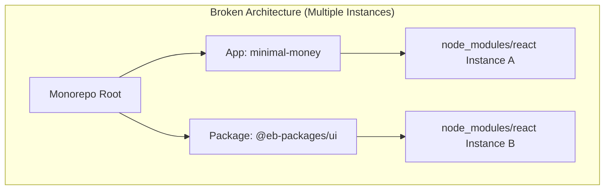
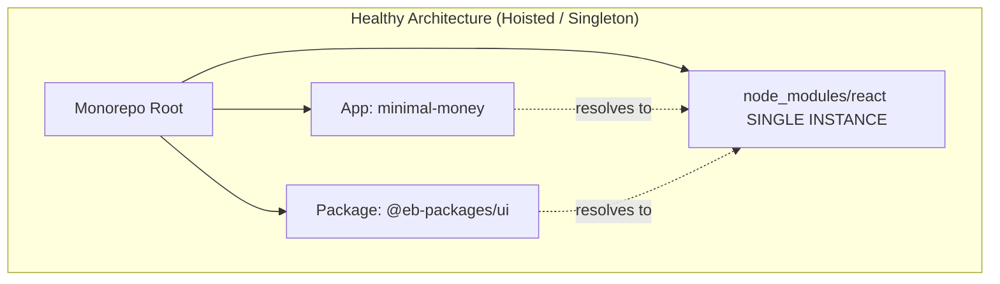

We were working on `minimal-money`, a React Native (Expo) application living inside the "Entity Builders" monorepo (managed with Yarn Workspaces). Everything seemed normal until the app exploded at runtime with one of the most infamous and frustrating errors in the ecosystem:

```text
Warning: Invalid hook call. Hooks can only be called inside of the body of a function component.
This could happen for one of the following reasons:
1. You might have mismatching versions of React and the renderer (such as React DOM)
2. You might be breaking the Rules of Hooks
3. You might have more than one copy of React in the same app
```

At first glance, the UI code of our internal package (`@eb-packages/ui`) respected all the rules of hooks. There were no weird conditionals or calls outside functions. The real cause was much darker and invisible at the source code level: **Yarn had installed two distinct instances of React**.

## 2. The Autopsy (The Technical Journey)

The problem lay in how Yarn Workspaces resolves and links dependencies, a concept known as **Hoisting**.

### The File of the Crime (`packages/ui/package.json`)

We had `react` and `react-native` listed **in both `peerDependencies` and `devDependencies`**:

```json
{
  "name": "@eb-packages/ui",
  "peerDependencies": {
    "react": "*",
    "react-native": "*"
  },
  "devDependencies": {
    "react": "19.1.0",
    "react-native": "0.76.0"
  }
}
```

### Why does this break the app?

React relies on a strict internal architectural pattern: **the Singleton**. It requires that there be _one and only one_ instance of the module in memory to track the render tree and the state of the hooks via the internal `ReactCurrentDispatcher` object.

By declaring `react` in the sub-package's `devDependencies`, and if that version (or the workspace requirements) clash even slightly with the version installed at the monorepo root or in the app (`minimal-money`), Yarn makes a defensive decision: **it creates a local `node_modules` inside `packages/ui`** instead of "hoisting" the dependency to the root.



When an imported component from `@eb-packages/ui` executed a hook (e.g., `useState`), it was using **Instance B**. But the app's main renderer was using **Instance A**. Since Instance B was not connected to the main render tree, its `ReactCurrentDispatcher` was `null`, triggering the "Invalid Hook Call".

### The Solution

1. **Remove misleading dependencies:** We deleted `react`, `react-native`, `react-native-svg` from the `devDependencies` of `packages/ui`. We left them **exclusively** in `peerDependencies`.
2. **Purge:** We deleted the local `node_modules` folders (`rm -rf packages/ui/node_modules`).
3. **Relink:** We ran a clean `yarn install` at the root. This forced the `ui` package to resolve its dependencies pointing to the single hoisted instance at the monorepo root.
4. **Clear Cache:** We restarted the bundler with `yarn start -c` so Metro would forget the old module resolution paths.



## 3. Deep Dive and Extra Study

### What is "Hoisting"?
Hoisting is the strategy used by package managers (Yarn, npm, pnpm) in monorepos to extract common dependencies to the project root. This saves disk space and installation time. However, when there are version conflicts, the manager does not hoist the dependency, pushing it down to the package's local folder instead.

### The Singleton Pattern in Core Libraries
Libraries like React or GraphQL are extremely sensitive to duplication. React maintains internal global state per module (`ReactCurrentDispatcher.current`). When you call `useState`, React looks for that dispatcher. If there are two copies of React, each has its own dispatcher. A component compiled against copy B cannot communicate with the renderer initialized by copy A.

### devDependencies vs peerDependencies in Libraries
*   **`peerDependencies`:** They tell the consumer (the app): *"I don't include this library, you must provide it within this version range for me to work."*
*   **`devDependencies`:** These are dependencies for the local development environment *of the package itself* (e.g., to run tests or Storybook inside the package folder).
If you define both, you run a high risk in Yarn that the local devDependency overrides the monorepo resolution, creating the local phantom instance.

## 4. Reflection Questions & Exercises

### Reflection questions:
1. If you need to run an isolated testing environment (like Jest) inside `packages/ui`, how would you provide the React dependency without causing hoisting conflicts across the rest of the monorepo?
2. Why is purging the Metro Bundler cache (`yarn start -c`) a critical step after altering the directory structure in `node_modules`?

### Lab Exercises (Break it to learn):
*   **Simulate a Phantom Dependency:** Go to a UI package and add a random dependency (e.g., `lodash` version 3) to `devDependencies`, and import that same dependency in the main App (but version 4). Examine the folder structure in `node_modules`. Where was each version installed?
*   **Deliberately break React:** Try recreating the "Invalid Hook Call" using method 2 described in the official error: wrap a `useEffect` inside an `if` block in one of your React Native components and watch the app crash at runtime.
