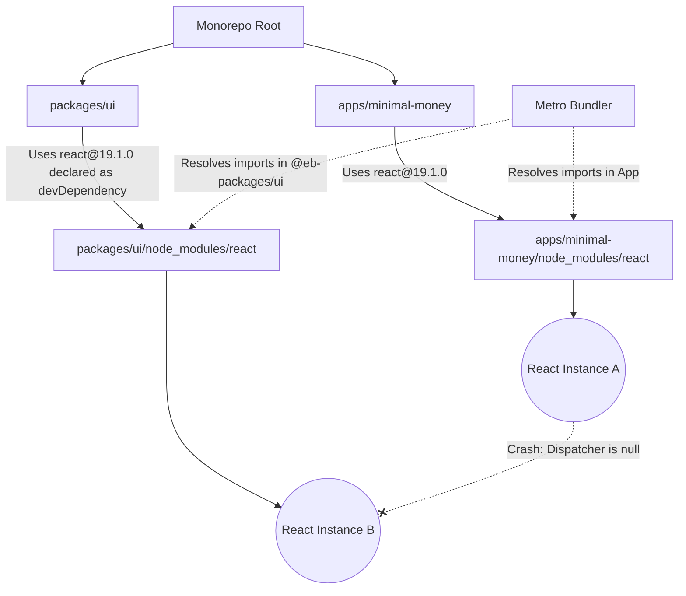
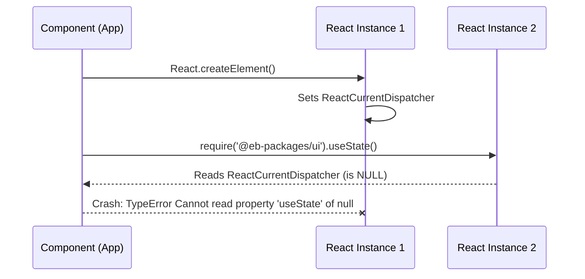

During development within the **Entity Builders** universe (our monorepo ecosystem built with Yarn Workspaces), the `minimal-money` app (Expo / React Native) suffered a runtime crash of the kind that makes you question your own sanity.

The log threw one of the most notorious errors in the React world:
```text
Warning: Invalid hook call. Hooks can only be called inside of the body of a function component.
ERROR  [TypeError: Cannot read property 'useState' of null]
```

**What was happening?**
At first glance, the code was flawless. We weren't violating the famous *Rules of Hooks* (no hooks inside loops, conditionals, or regular functions). However, the stack trace showed that during initialization (specifically when booting up a Sentry tracker), React's *dispatcher* was returning `null` when trying to read `useState`.

## 2. The Autopsy (The Technical Journey)

The error `Cannot read property 'useState' of null` means that React has completely lost its internal context. In 90% of cases within complex monorepo architectures, the root cause isn't poorly written code, but a problem of **module resolution and dependency collision**.

### The Visual Diagnosis



To understand what was happening, we used Yarn's introspection commands (`yarn why react`). We found a fragmented ecosystem:
- The `minimal-money` app explicitly depended on `react@19.1.0`.
- Other apps in the workspace used different versions (`18.3.1`, `19.2.4`, etc.).
- **The real culprit:** Our own logic package `@eb-packages/ui`.

In the `package.json` of `packages/ui`, core libraries like `react`, `react-native`, `react-native-svg`, and `@react-native-async-storage/async-storage` were strictly declared as **`devDependencies`**.

### The Mechanism of Failure
When we ran `yarn install`, Yarn attempted to perform *hoisting* (elevating dependencies to the root to share a single module). However, due to the version discrepancies demanded by different apps and the strict declarations in `devDependencies`, Yarn was forced to instantiate a **local** copy of React inside `packages/ui/node_modules/react`.

Metro Bundler, on the other hand, is configured with `watchFolders` to monitor the entire monorepo.
- When an app component imported a hook: it resolved to `apps/minimal-money/node_modules/react`.
- When a component from the UI package imported it: Metro resolved to `packages/ui/node_modules/react`.

**The Result:** Two completely different instances of React loaded into the same JavaScript memory. Since hooks rely on an internally dynamically injected object called the *dispatcher*, one instance couldn't find the state initialized by the other.

### The Surgical Solution
1. **Pruning Fake Dependencies:** We removed `react`, `react-native`, and the native libraries from the `devDependencies` of `@eb-packages/ui`. We only kept them in `peerDependencies` (the correct contract for shared libraries).
2. **Physical Extermination:** We destroyed the duplicated directories using `rm -rf packages/ui/node_modules/...`.
3. **Re-linking:** We ran a clean `yarn install` at the root.
4. **Metro Purge:** We started the bundler with the `-c` flag (`yarn start:minimal-money -c`) to clear the cache of obsolete paths and force resolution to the single module now living at the root/app level.

---

## 3. Deep Dive and Extra Study

### The Anatomy of React and Why It's a Singleton
Unlike utility packages like `date-fns` or `lodash`, where having two copies in memory only penalizes bundle size, React depends on per-thread global state.
In the React source code, there is an object called `ReactCurrentDispatcher`. This object is responsible for connecting functions like `useState` with the state of the component currently being rendered *in that exact millisecond*.



If two copies of React exist in the same runtime, there are two different `ReactCurrentDispatcher`s. When a component compiled against copy "B" tries to ask React for a hook, but the React tree was initiated by copy "A", copy "B" has its *dispatcher* set to `null`.

### Peer vs Dev Dependencies in Libraries
- **Peer Dependencies:** *"If you're going to use this package, you as the host must provide this dependency"*. Ideal for frameworks like React.
- **Dev Dependencies:** *"For me to develop this package in isolation (run tests, compile TypeScript), I need this"*.
The problem arises because package managers will sometimes physically install your `devDependencies` in the sub-package, poisoning the bundler's resolution tree if the host accidentally imports them.

---

## 4. Reflection Questions & Exercises

### Self-Assessment
1. What is the internal React object that suffers when there are multiple instances in memory, causing the "Invalid Hook Call"?
2. If you were using Webpack (instead of Metro) and had two versions of React, what is the standard configuration technique to fix it without modifying every sub-package's `package.json`?
3. Why does purely declaring `react` in your internal package's `peerDependencies` (`@eb-packages/ui`) not break typing when compiling with TypeScript in VSCode?

### Practical Exercises
- **Chaos Injection:** Go to `packages/logic/package.json` and declare `date-fns: "^1.0.0"`. Go to `minimal-money` and set `date-fns: "^2.0.0"`. Run `yarn install`, then run `yarn why date-fns`. Study how Yarn manages libraries that *can* coexist in the same bundle.
- **Runtime Path Mapping:** Open your application's entry file (`App.tsx` of `minimal-money`). In the first rendering cycle (outside any function), add the line: `console.log(require.resolve('react'))`. Watch your terminal to see which physical file is actually being used to load the core library. Move the dependency and run the experiment again.
