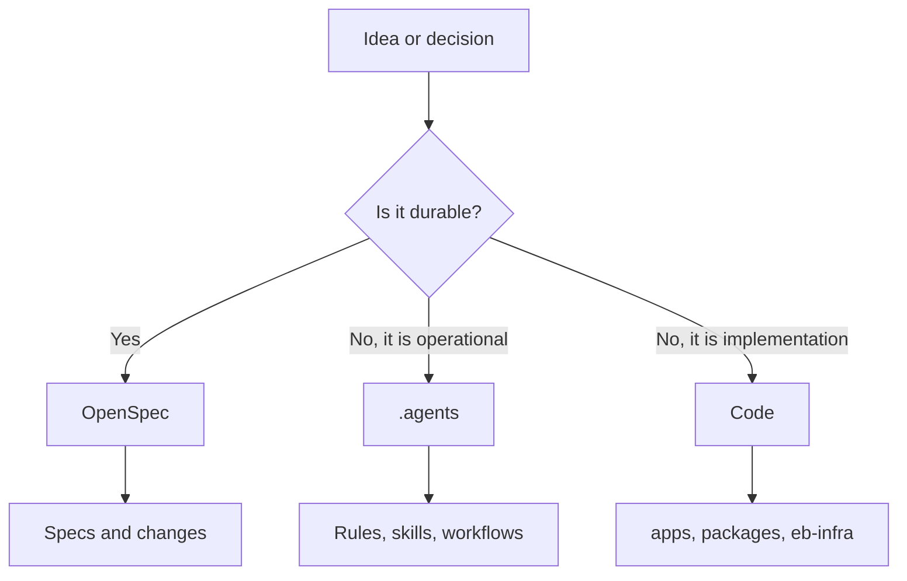
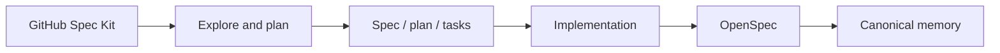
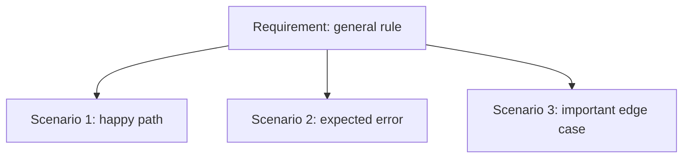
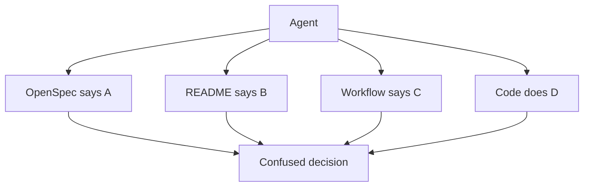
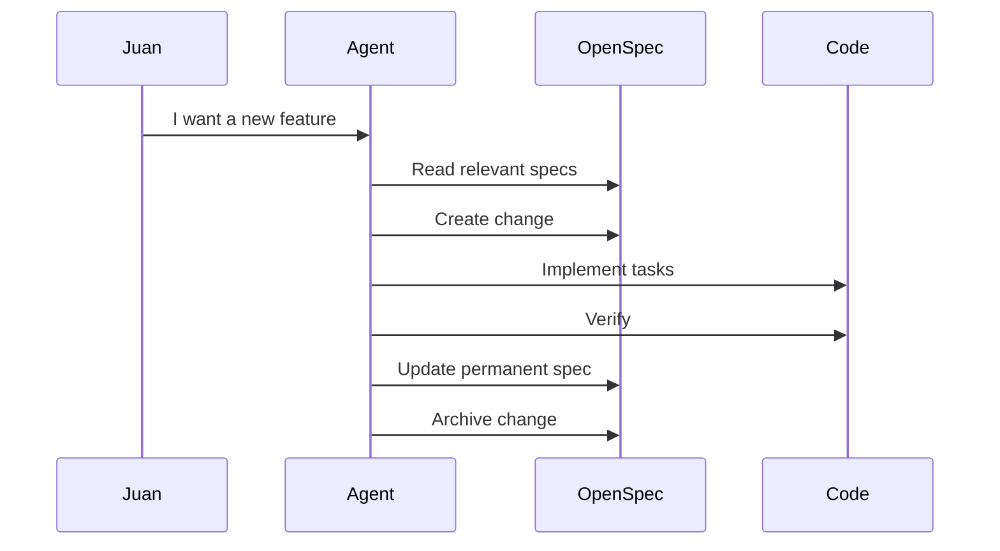

# Spec-Driven Development: giving an agent-powered repo a real memory

> The core idea: when you work with AI agents, code is not enough. You need a
> shared memory that says what you are building, why it exists, which rules must
> not break, and how each meaningful change gets validated.

---

## 1. The Context and the Problem

Entity Builders had started to accumulate several layers of memory:

- `.agent/`
- `.agents/`
- `.codex/`
- `ops/hermes/`
- `openspec/`
- per-app READMEs
- loose workflows
- context inside `apps/*/.agents`

Each folder contained something useful, but the whole system was becoming hard
to read. The problem was not "there are many files." The real problem was more
subtle:

> There were several competing sources of truth.

When a repository has a single app, this is annoying but manageable. Entity
Builders is not a single app: it is a monorepo with products, shared packages,
Supabase infrastructure, skills, workflows, and agents.

In that context, if memory is not organized, strange things happen:

- An agent reads an old rule and makes a bad decision.
- A feature exists in code but not in durable documentation.
- An operational workflow gets confused with a product rule.
- An app like Tablia has context in three different places.
- The next AI session starts without understanding the map.

Two questions showed up:

1. What is OpenSpec and why does it help us?
2. What does GitHub Spec Kit have to do with this?

The short answer:

- **OpenSpec** is our canonical memory.
- **GitHub Spec Kit** can be a workshop for thinking through large changes.
- **`.agents`** is the agent toolbox.
- **Code** still lives in `apps/`, `packages/`, and `eb-infra/`.

---

## 2. The Autopsy: the technical journey

### Step 1: separate durable memory from tools

Before the cleanup, several things were mixed together:

```txt
.agent/
.agents/
ops/hermes/
apps/tablia/.agents/
openspec/
```

The first move was to give each concern a home:

```txt
.agents/
  rules/
  skills/
  workflows/
  apps/
  integrations/

.codex/
  skills/

openspec/
  specs/
  changes/
  config.yaml
  project.md
```

The rule was:

| Information type | Home |
| --- | --- |
| Durable system behavior | `openspec/specs/` |
| Change in progress | `openspec/changes/` |
| Agent rules, skills, and workflows | `.agents/` |
| OpenSpec/Codex generated skills | `.codex/skills/` |
| Real implementation | `apps/`, `packages/`, `eb-infra/` |

Visually:



### Step 2: make OpenSpec the canon

OpenSpec organizes memory through two kinds of artifacts.

#### Permanent specs

They describe the current system:

```txt
openspec/specs/app-tablia/spec.md
openspec/specs/platform-supabase-strategy/spec.md
openspec/specs/platform-agent-workspace/spec.md
```

A spec says:

> This is what the system must satisfy now.

Example:

```md
### Requirement: Data Isolation

Tablia SHALL use the shared `eb-core` Supabase project with the dedicated
`tablia` schema until it graduates to its own project.

#### Scenario: Runtime code queries Supabase

- **WHEN** Tablia runtime code queries the database
- **THEN** it uses the schema-scoped Supabase client
- **AND** it queries unprefixed table names such as `venues`, `menus`,
  `menu_categories`, `menu_items`, and `chat_sessions`
```

This is not a decorative comment. It is a rule that can guide future code.

#### Changes

They are temporary change folders:

```txt
openspec/changes/add-tablia-reservations/
  proposal.md
  design.md
  tasks.md
  specs/
```

A change says:

> We want to change something. Here is the reason, the design, the tasks, and
> the behavioral delta.

When it is done, it gets archived:

```txt
openspec/changes/archive/2026-05-30-migrate-tablia-agent-context/
```

### Step 3: migrate Tablia as the first real case

Tablia had context in:

```txt
.agents/apps/tablia/AGENT.md
.agents/apps/tablia/workflows/dev.md
.agents/apps/tablia/workflows/deploy.md
apps/tablia/README.md
apps/tablia/src/
eb-infra/supabase/migrations/
```

The durable part moved to:

```txt
openspec/specs/app-tablia/spec.md
```

The Tablia spec now documents:

- Product identity.
- Public and protected routes.
- Venue management.
- AI menu import.
- Menu review and publish.
- Public landing.
- Public menu.
- Chat assistant.
- Analytics.
- Customer memory, loyalty, and campaigns.
- Data isolation with the `tablia` schema.
- Local development.
- Production deployment.

Operational workflows did not move into OpenSpec. They stayed in:

```txt
.agents/apps/tablia/
```

Because one thing is saying:

> Tablia must deploy as a static Vite app to Cloudflare.

And another thing is saying:

> Run `yarn workspace tablia deploy:prod`.

The first one is durable behavior. The second one is operations.

### Step 4: understand where GitHub Spec Kit fits

GitHub Spec Kit is also an SDD tool, but with a different emphasis.

OpenSpec feels like:

```txt
the repository's canonical memory
```

Spec Kit feels like:

```txt
a workshop for producing a feature or app
```

Spec Kit proposes a flow like:

```txt
constitution -> specify -> plan -> tasks -> implement
```

OpenSpec proposes a flow like:

```txt
proposal -> specs -> design -> tasks -> apply -> archive
```

They are similar, but not identical.



The healthy rule for Entity Builders:

> Spec Kit can help us think through big changes. OpenSpec decides what remains
> as durable truth.

---

## 3. Deep Dive and Extra Study

### SDD is not traditional documentation

Traditional documentation is often descriptive:

> "The system does X."

An SDD spec should be more normative:

> "The system SHALL do X when Y happens."

The key word is **observable**.

A good spec does not describe the private feelings of the code. It describes
behavior that can be checked:

```md
### Requirement: Owner opens dashboard

Tablia SHALL expose a protected owner dashboard.

#### Scenario: Authenticated owner opens dashboard

- **WHEN** an authenticated owner opens `/dashboard`
- **THEN** the app renders the dashboard
```

That is much better than:

```md
The dashboard is nice and should work well.
```

### Requirement vs Scenario

A **requirement** is a rule.

A **scenario** is a concrete situation that tests the rule.



Example:

```md
### Requirement: AI Menu Import

Tablia SHALL import menus from text and supported files, parse them with AI,
and store the parsed result for review before publication.

#### Scenario: Owner imports menu text

- **WHEN** an owner submits menu text
- **THEN** Tablia creates a menu in `parsing` status
- **AND** the menu moves to `review` status with parsed JSON available
```

### Brownfield vs Greenfield

Entity Builders is **brownfield**: it already has code, decisions, useful hacks,
scripts, migrations, and working apps.

That matters because a greenfield-oriented tool can say:

> Let's start perfectly from scratch.

A brownfield-friendly tool must say:

> Let's read what exists, respect what works, and add structure without breaking
> the development loop.

That is why OpenSpec made sense first. It does not require us to rebuild the
repo. It can be added on top as memory.

### The danger of two sources of truth

The main risk of using OpenSpec and Spec Kit together is duplicating the truth:

```txt
openspec/specs/app-tablia/spec.md
.specify/specs/tablia/spec.md
README.md
.agents/apps/tablia/AGENT.md
```

If they all say the same thing, it looks harmless. Over time, they drift.

When they drift, the agent faces an impossible situation:



Solution:

```txt
OpenSpec wins for durable behavior.
.agents wins for operations.
Code wins for executable reality.
```

### The correct loop

The healthy loop is:



If the last step is missing, the repo gains code but loses product memory.

---

## 4. Reflection Questions and Exercises

### Questions

1. If a fact appears in `.agents/apps/tablia/AGENT.md` and also in
   `openspec/specs/app-tablia/spec.md`, which one should win for durable
   behavior?

2. Why is it a bad idea to store long deployment commands inside a permanent
   product spec?

3. What risk appears if GitHub Spec Kit and OpenSpec are used as independent
   sources of truth?

### Exercise 1: classify information

Classify these statements:

| Statement | Type | Destination |
| --- | --- | --- |
| "Tablia uses the `tablia` schema" | ? | ? |
| "Run `yarn start:tablia`" | ? | ? |
| "The chat must answer from menu context" | ? | ? |
| "Hermes should run a daily brief" | ? | ? |

Expected answer:

- `tablia` schema: OpenSpec.
- Dev command: `.agents`.
- Chat rule: OpenSpec.
- Hermes brief: `.agents/integrations/hermes`.

### Exercise 2: write a requirement

Imagine we add reservations to Tablia.

Write a requirement:

```md
### Requirement: Reservations

Tablia SHALL ...

#### Scenario: Guest requests reservation

- **WHEN** ...
- **THEN** ...
```

The rule: if you cannot write the scenario, you do not understand the feature
yet.

### Exercise 3: decide whether to use Spec Kit

For each case, decide whether you would use only OpenSpec or also Spec Kit:

| Case | Tool |
| --- | --- |
| Change button copy | ? |
| Create a new app | ? |
| Add Stripe billing | ? |
| Fix a typo in README | ? |
| Redesign Tablia end-to-end | ? |

A reasonable answer:

- Small copy: nothing, or OpenSpec only if behavior changes.
- New app: Spec Kit as workshop + OpenSpec as canon.
- Billing: probably Spec Kit + OpenSpec.
- Typo: no SDD needed.
- Full Tablia redesign: Spec Kit + OpenSpec.

---

## Sources

- [OpenSpec Getting Started](https://openspec.pro/getting-started/)
- [Fission-AI/OpenSpec](https://github.com/Fission-AI/OpenSpec)
- [GitHub Spec Kit](https://github.com/github/spec-kit)
- [Spec-Driven Development in GitHub Spec Kit](https://github.com/github/spec-kit/blob/main/spec-driven.md)
- [Spec Kit docs](https://github.github.io/spec-kit/)

