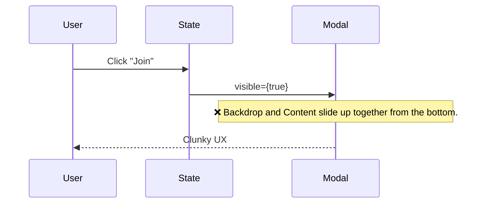
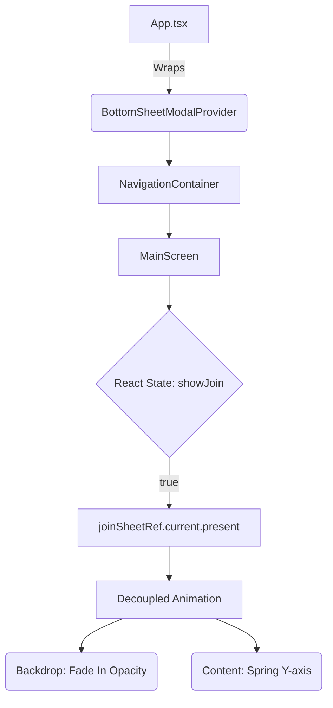

In modern app development (like the one we build with Expo and React Native), micro-interaction details are what separate a merely "functional" app from a "premium" one.

The issue manifested in the "Share" and "Join" Budget flows. We were using the standard React Native `<Modal>` component with the `animationType="slide"` property.

**The symptom:** When opening the drawer, the entire component—including the translucent black background (`backdrop`)—slid up from the bottom edge of the screen. This created a clunky, unnatural, and outdated feel. Users expect the backdrop to simply "fade in" (smoothly darken) while the content drawer itself slides up using bouncy spring physics.

## 2. The Autopsy (The Technical Journey)

### The Problem with the Standard `Modal`

The native `<Modal>` encapsulates all its content within an isolated view. When instructed to use `animationType="slide"`, the underlying view engine pushes the entire screen-sized rectangle upwards.



### The Solution: Gorhom BottomSheetModal

To resolve this, we orchestrated a refactor toward `@gorhom/bottom-sheet`, specifically utilizing its `BottomSheetModal` variant. This requires decoupling the modal layer from the application's gesture and view layer.

1.  **The Global Provider:** We injected `BottomSheetModalProvider` at the root of the app (`App.tsx`). This establishes a portal where bottom sheets can be mounted safely above the entire React Navigation hierarchy.
2.  **Transition from Declarative to Imperative (Refs):** Instead of controlling the render purely via a boolean in JSX (`visible={showJoin}`), we bind React state to imperative component methods via `Refs` (`.present()` and `.dismiss()`).
3.  **Decoupled Animations:** We utilize a `BottomSheetBackdrop` that manages its own opacity independently from the Y (vertical) position of the drawer.



**Key Code:**
```tsx
const renderBackdrop = useCallback(
  (props) => (
    <BottomSheetBackdrop
      {...props}
      appearsOnIndex={0}
      disappearsOnIndex={-1}
      opacity={0.6}
    />
  ),
  []
);

// Imperative control tied to lifecycle
useEffect(() => {
  if (showJoin) joinSheetRef.current?.present();
  else joinSheetRef.current?.dismiss();
}, [showJoin]);
```

## 3. Deep Dive and Extra Study

### Portals and the "Provider" Pattern

In React Native, Z-Index stacking is notoriously strict and often confined to the native hierarchy. If you nest a complex modal deep within the component tree, you might suffer from clipping or Z-index battles against navigation bars.
The `BottomSheetModalProvider` uses the equivalent of a "Portal" pattern in React Web. It creates a safe zone at the root of the application to render top-level modals, ensuring the sheets float cleanly over tab bars and native headers without conflict.

### Reanimated Physics vs. React Native Animated

Internally, Gorhom utilizes `react-native-reanimated` v2/v3 to interpolate the pan-gesture (finger drag) position and map it directly on the UI Thread.
The legacy `Modal` delegates the slide to the operating system, which uses a pre-baked "view presentation" animation. By migrating to Gorhom, we gain "Gesture Interruptibility"—the ability to catch the modal while it's springing up and immediately drag it back down without lag.

## 4. Reflection Questions & Exercises

### Reflection Questions
1. Why does `BottomSheetModal` require a "Provider" at the root of the application, whereas the standard React Native `<Modal>` does not?
2. If a user starts dragging the Bottom Sheet down but changes their mind and drags it back up without releasing their finger, why does it feel perfectly responsive? (Hint: UI Thread vs. JS Thread).
3. How do you synchronize an imperative change (like a user swiping the modal away to close it) back into declarative React state (`useState`)?

### Practical Exercises
- **The Anti-Pattern:** Go back into the code, remove the `BottomSheetModalProvider` from `App.tsx`, and attempt to render the `BottomSheetModal` within `MainScreen`. Observe the Context error thrown in the console.
- **Micro-interactions:** Modify the `BottomSheetBackdrop` by interpolating a blur effect (`BlurView`) instead of using a solid black color. Tie the blur intensity to the animated value of the Bottom Sheet so that the app behind it blurs dynamically based on how high the sheet is dragged.
